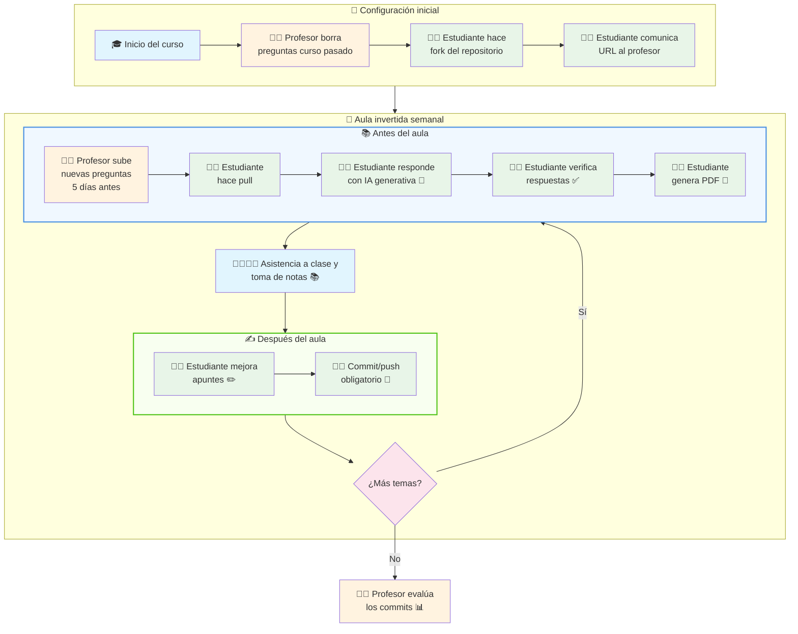

# 🔄 Metodología de trabajo paso a paso

La metodología está diseñada para crear un flujo de trabajo continuo y evaluable a lo largo del curso. A continuación se describe el proceso paso a paso:

## 🎯 Inicio del curso

1. **Preparación del profesor**: A principio de curso, el profesor realiza un commit que borra todas las preguntas del año anterior (eliminando el contenido de la carpeta `doc/enunciados`). Esto no pretende ocultar el material anterior, sino forzar a los estudiantes a hacer un `pull` cuando se anuncie cada nuevo cuestionario, asegurando que siempre trabajen con la versión más actualizada.

2. **Fork del estudiante**: Cada estudiante debe hacer un fork del repositorio a su cuenta personal de GitHub para comenzar a trabajar. Debe comunicar la URI de su repositorio al profesor.

## 🔁 Ciclo iterativo semanal

Una vez establecido el repositorio, se sigue un ciclo iterativo para cada clase teórica:

1. **Publicación de preguntas (5 días antes)**: El profesor sube las preguntas nuevas al cuestionario correspondiente al tema que se tratará en la próxima clase teórica.

2. **Actualización del estudiante**: El estudiante hace `pull` para traer el nuevo cuestionario a su repositorio local.

3. **Respuesta previa a la clase**: El estudiante comienza a responder las preguntas **antes** de la clase teórica, utilizando IA generativa como apoyo inicial y verificando las respuestas con fuentes confiables.

4. **Generación de PDF**: El estudiante genera el PDF del cuestionario respondido para llevarlo a la clase teórica y poder tomar notas rápidas sobre él (ya sea en tablet, impreso en papel, o similar).

5. **Asistencia a clase**: Durante la clase teórica, el estudiante puede tomar notas adicionales directamente sobre el PDF o complementar sus apuntes digitales.

6. **Consolidación de apuntes**: Después de la clase, el estudiante pasa a limpio sus apuntes, incorporando las aclaraciones y ampliaciones surgidas durante la clase teórica.

7. **Commit obligatorio**: El estudiante **DEBE** realizar al menos un commit con sus apuntes de esa semana. Idealmente, podría hacer dos commits: uno antes de la clase (con las respuestas iniciales) y otro después de la clase (con las mejoras y aclaraciones).

## 📊 Evaluación continua

Al final del curso, el profesor puede evaluar la actividad del estudiante revisando el historial de commits, valorando la regularidad y calidad de las contribuciones como parte de la nota final de la materia.

## 📋 Diagrama del flujo de trabajo

## 🔧 Herramientas y recursos necesarios

Para seguir esta metodología, los estudiantes necesitarán:

- **Cuenta de GitHub**: Para hacer fork y gestionar su repositorio personal
- **Git**: Para realizar commits y sincronizar cambios
- **Editor de Markdown**: Como VS Code, Typora, o cualquier editor de texto
- **Herramientas de IA generativa**: ChatGPT, GitHub Copilot, Gemini, etc.
- **Generador de PDF**: Este repositorio incluye un sistema completo de generación de PDF basado en Conda y Pandoc. Ver las [instrucciones detalladas en el README](README.md#instrucciones-para-generar-pdf-opcional-🖨️) para configurar el entorno.

## 💡 Consejos para el éxito

1. **Consistencia**: Mantener un ritmo regular de trabajo y commits
2. **Calidad sobre cantidad**: Enfocarse en respuestas bien fundamentadas y verificadas
3. **Participación activa**: Aprovechar las clases teóricas para aclarar dudas y ampliar conocimientos
4. **Uso responsable de IA**: Siempre verificar y personalizar las respuestas generadas por IA
5. **Documentación clara**: Usar commits descriptivos que reflejen el progreso del aprendizaje

## 🎯 Objetivos de aprendizaje

Esta metodología busca desarrollar:

- **Competencias técnicas**: Manejo de Git, Markdown, y herramientas de IA
- **Aprendizaje autónomo**: Capacidad de investigar y verificar información
- **Pensamiento crítico**: Evaluación y mejora continua de respuestas
- **Hábitos profesionales**: Gestión de versiones y documentación del trabajo
- **Preparación para la evaluación**: Apuntes personalizados y bien estructurados
